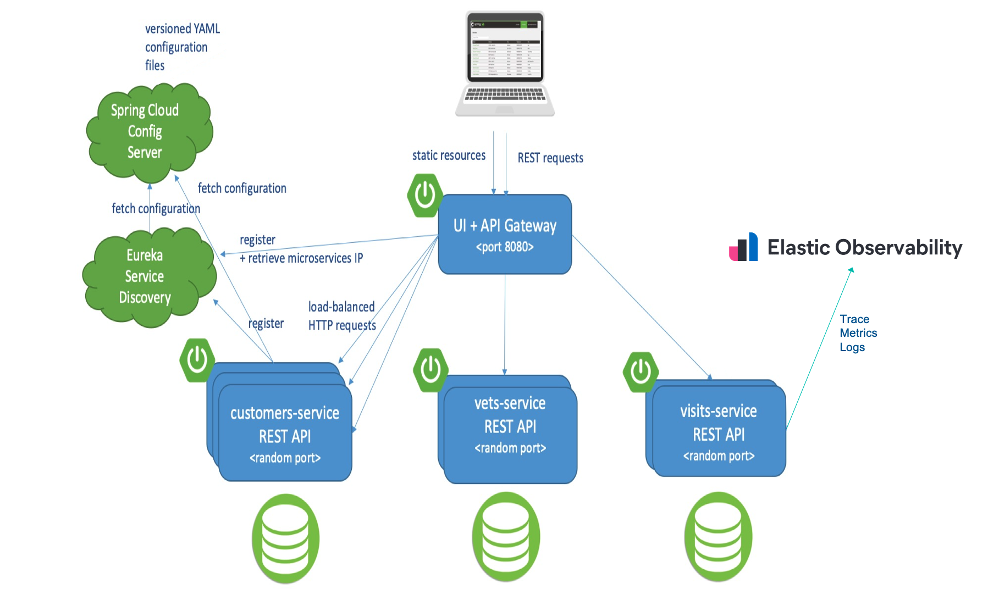

# Distributed version of the Spring PetClinic Sample Application built with Spring Cloud and Elastic Observability

[](https://opensource.org/licenses/Apache-2.0)

This repo is a fork from the original version of "[Distributed version of the Spring PetClinic Sample Application built with Spring Cloud](https://github.com/spring-petclinic/spring-petclinic-microservices)" in order for Elastic Observability demonstration purpose. Although the original one uses [Zipkin](https://zipkin.io/) for distributed logging & tracing, and [Prometheus](https://prometheus.io/) for metrics monitoring, this version uses [Elastic Observability](https://www.elastic.co/observability) for distributed tracing, metrics and logging instead.

## Starting services locally without Docker

Every microservice is a Spring Boot application and can be started locally using IDE ([Lombok](https://projectlombok.org/) plugin has to be set up) or `../mvnw spring-boot:run` command. Please note that supporting services (Config and Discovery Server) must be started before any other application (Customers, Vets, Visits and API).
This repo does not include the Elastic Stack itself such as Elasticsearch, Kibana and Elastic Agent. This repo does not include the Elastic Stack itself such as Elasticsearch, Kibana and Elastic Agent. These instances require to be started outside of Spring Petclinic microservices.
If everything goes well, you can access the following services, except the Elastic Stack related services, at given location:
* Discovery Server - http://localhost:8761
* Config Server - http://localhost:8888
* AngularJS frontend (API Gateway) - http://localhost:8080
* Customers, Vets and Visits Services - random port, check Eureka Dashboard 

The Config Server is changed to use local file system with `natvie` Spring profile instead of Git repository.

## Starting services locally with docker-compose
In order to start entire infrastructure using Docker, you have to build images by executing `./mvnw clean install -P buildDocker` 
from a project root. Once images are ready, you can start them with a single command
`docker-compose up`. Containers startup order is coordinated with [`dockerize` script](https://github.com/jwilder/dockerize). 
After starting services it takes a while for API Gateway to be in sync with service registry,
so don't be scared of initial Spring Cloud Gateway timeouts. You can track services availability using Eureka dashboard
available by default at http://localhost:8761.

*NOTE: Under MacOSX or Windows, make sure that the Docker VM has enough memory to run the microservices. The default settings
are usually not enough and make the `docker-compose up` painfully slow.*

## Starting the Elastic Stack
Although you can run the Elastic Stack in any way, the easiest way is spinning up the related services on [Elastic Cloud](https://www.elastic.co/cloud/).
In order to demonstrate all the features in the demo,  you need to deploy Elastic Agent (APM & Fleet node in Elastic Cloud) in addition to Elasicsearch node and Kibana node.
Please refer to the following links for more details:

* [Create your deployment](https://www.elastic.co/guide/en/cloud/current/ec-create-deployment.html)
* [Ingest application traces with Elastic Agent](https://www.elastic.co/guide/en/observability/current/ingest-traces.html)

### Configure Elastic APM Java Agent to ingest application traces
In order for Elastic APM Java Agent to work, you need to configure at least following two properties in the `spring-petclinic-config-server/src/main/resources/config/application.yml`.
* server_url
* secret_token
```
# Elastic APM
elastic:
  apm:
    enabled: true
    environment: dev
    # Change the following APM_Server_URL & Secret_Token
    server_url: APM_Server_URL
    secret_token: Secret_Token
    log_ecs_reformatting: OVERRIDE
    enable_experimental_instrumentations: true
```
Although there are several ways to pass the configuration to the application, centralized configuration management with Spring Cloud Config is applied as a Spring way here. 
See [the documentation for the configuration of Elastic APM Java Agent](https://www.elastic.co/guide/en/apm/agent/java/current/configuration.html).

### Configure Elastic APM Real User Monitoring (RUM) JavaScript Agent 
In order for Elastic RUM Agent to work, you need to add `<script>` tags to the HTML page `spring-petclinic-api-gateway/src/main/resources/static/index.html` as following.
Change the APM_Server_URL to the appropriate one.
```
<script src="/scripts/elastic-apm/elastic-apm-rum.umd.min.js" crossorigin></script>
<!-- Change the following APM_Server_URL -->
<script>
  elasticApm.init({
    serviceName: 'spring-petclinic-js',
    serverUrl: 'APM_Server_URL',
    environment: 'dev'
  })
</script>
```
See [the documentation for Elastic APM RUM Agent Set Up](https://www.elastic.co/guide/en/apm/agent/rum-js/current/install-the-agent.html).

## Understanding the Spring Petclinic application

[See the presentation of the Spring Petclinic Framework version](http://fr.slideshare.net/AntoineRey/spring-framework-petclinic-sample-application)

[A blog bost introducing the Spring Petclinic Microsevices](http://javaetmoi.com/2018/10/architecture-microservices-avec-spring-cloud/) (french language)

You can then access petclinic here: http://localhost:8080/


**Architecture diagram of the Spring Petclinic Microservices**




## Database configuration

In its default configuration, Petclinic uses an in-memory database (HSQLDB) which gets populated at startup with data.
A similar setup is provided for MySql in case a persistent database configuration is needed.
Dependency for Connector/J, the MySQL JDBC driver is already included in the `pom.xml` files.

